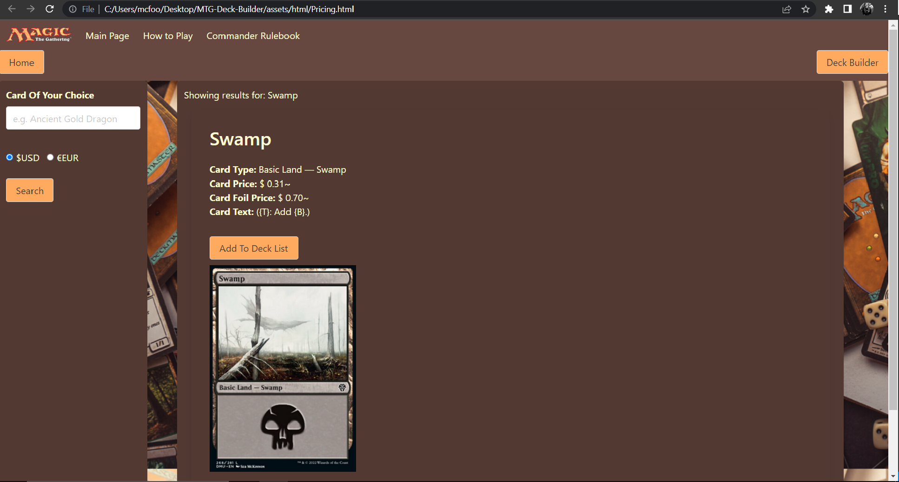

# Project-1 // MTG-Deck-Builder
Magic the Gathering Deck Builder is a website that will allow you to build a commander deck and price out the cost of purchasing the required cards for the current market rate of said cards in USD or EUR. This is acomplished using responsive searching and pricing functions utilizing the scryfall api, the currency layer api is used to convert prices to euros, the Bulma CSS framework is used to provide a polished interface which is responsive and scalable between mobile and desktop environments. Client-side storage is used to pass data between pages providing seamless functionality and moment.js api provides time data to anchor the site with a live environment feeling.

Link to live deployed site: https://jacksonwolfd20.github.io/MTG-Deck-Builder/

